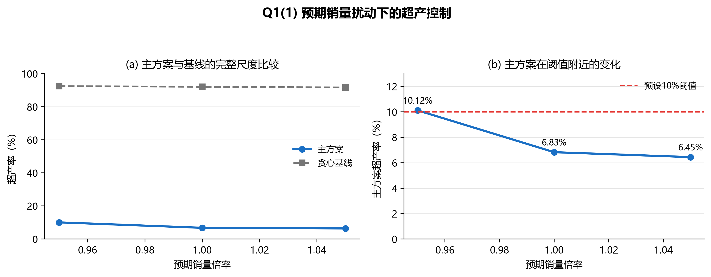

## 5 第一问：确定性种植策略

### 5.1 两种超产处置模型

情形（1）取 $r=0$。为体现控制滞销的优先级，在利润之外加入超产货值惩罚，目标为

$$\max\ \Pi-0.50\sum_{j,t,s}p_j e_{jts}-\lambda\sum_{i,j,t,s}y_{ijts}. \tag{7}$$

情形（2）取 $r=0.5$，直接最大化式（3）给出的利润并扣除碎片化惩罚。两种情形均与满足全部硬约束的利润排序贪心方案比较。

### 5.2 结果

| 情形 | 方案 | 年均利润/万元 | 超产率 | 前五作物面积占比 |
|---|---:|---:|---:|---:|
| 超产滞销 | 滚动MILP | 3372.86 | 6.83% | 65.17% |
| 超产滞销 | 贪心基线 | -259.55 | 92.12% | 96.56% |
| 超产半价销售 | 滚动MILP | 6141.21 | 60.29% | 63.28% |
| 超产半价销售 | 贪心基线 | 5828.45 | 92.12% | 96.56% |

情形（1）中，主方案在保持正利润的同时明显降低了相对基线的超产率。情形（2）的高超产率不能直接解释为浪费率，因为超产部分具有 50% 的销售残值。

**图1** 预期销量在基准值附近变化时，主方案超产率始终远低于贪心基线；销量下降 5% 时，主方案超产率为 10.12%，略高于预设阈值。

三个滚动窗口的最大 MIP gap 为 48.86%。因此，这些结果是通过全部硬约束检查的可行近似方案，不能作为全局最优证明。

