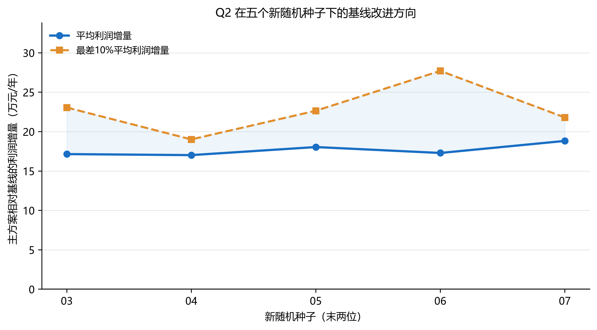

## 6 第二问：独立情景随机规划

### 6.1 情景与风险目标

采用固定种子生成 30 个独立情景。小麦和玉米销量按 5%—10% 年增长变化，其他作物销量在基准附近波动；亩产、成本和价格均按题面范围生成。种植面积在情景间共享，销售量随情景变化。

条件风险价值可借助辅助变量转化为线性形式[3]，并已用于含价格和产量不确定性的作物选择 MILP[4]。令损失 $L^{\omega}=-\Pi^{\omega}$，以 $\alpha=0.90$ 定义尾部风险变量：

$$\xi_{\omega}\ge L^{\omega}-\eta,\qquad \xi_{\omega}\ge0. \tag{8}$$

模型最小化负期望利润与 CVaR 损失的加权和：

$$-\frac1{|\Omega|}\sum_{\omega}\Pi^{\omega}+0.15\left[\eta+\frac1{(1-0.90)|\Omega|}\sum_{\omega}\xi_{\omega}\right]+\lambda\sum y_{ijts}. \tag{9}$$

基线模型使用 30 个情景的均值参数求解，再在完全相同的情景上评价。

### 6.2 结果与复评

| 指标 | 主方案 | 均值参数基线 |
|---|---:|---:|
| 年均利润/万元 | 6820.61 | 6801.43 |
| 最差10%平均利润/万元 | 6642.93 | 6614.38 |
| 5%分位利润/万元 | 6654.01 | 6632.37 |
| 平均超产率 | 58.03% | 59.84% |

主方案年均利润比基线高 19.18 万元，最差 10% 情景平均利润高 28.56 万元。两方案面积重合度仅为 20.66%，说明风险目标引起了明显的结构调整，但经济改进幅度仍较小。

**图2** 五个新随机种子下，主方案相对基线的平均利润与最差 10% 平均利润增量均为正。平均利润增量为 17.02—18.82 万元，下行利润增量为 19.01—27.71 万元。

三个窗口最大 MIP gap 为 4.40%，低于 5% 预设线。复评支持主方案在所测试情景分布下具有小幅且方向稳定的优势，但不代表对任意未来分布均占优。
