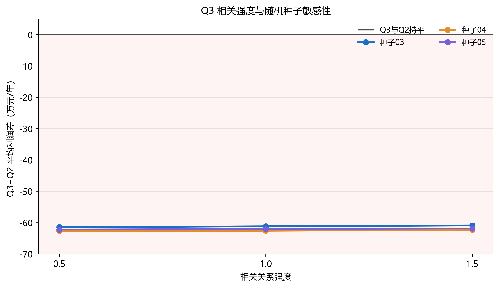

## 7 第三问：相关性与替代互补关系

### 7.1 相关情景结构

在亩产、成本、销量和价格四类冲击之间设置中等强度相关矩阵

$$R=\begin{bmatrix}
1&-0.35&0.25&0.30\\
-0.35&1&-0.10&-0.20\\
0.25&-0.10&1&0.40\\
0.30&-0.20&0.40&1
\end{bmatrix}. \tag{10}$$

该矩阵最小特征值为 0.5832，满足正定性。作物按豆类、粮食、蔬菜和食用菌分组，同组相对价格偏离通过弱替代响应影响销量，粮食与豆类之间加入弱互补响应。优化目标和种植约束与第二问相同。

### 7.2 与第二问方案比较

| 指标 | Q3独立方案 | Q2方案在相关情景下 |
|---|---:|---:|
| 年均利润/万元 | 6756.33 | 6819.68 |
| 最差10%平均利润/万元 | 6568.42 | 6635.30 |
| 平均超产率 | 59.81% | 58.03% |

Q3 方案年均利润低 63.35 万元，最差 10% 平均利润低 66.89 万元；两方案面积重合度为 42.65%。最大 MIP gap 为 3.63%，硬约束检查全部通过。

**图3** 三档相关强度和三个新随机种子下，Q3−Q2 平均利润差均为负，约为 -62.67 至 -60.88 万元。Q3 固定方案平均利润的相对极差为 0.356%。

因此，相关结构确实改变了种植组合，但当前模拟设定下的独立 Q3 方案没有提高收益或下行表现。本文保留该方案以完整回答第三问，同时将第二问方案作为明确对照。式（10）和替代、互补响应均为模拟设定，不能解释为观测估计或因果关系。

